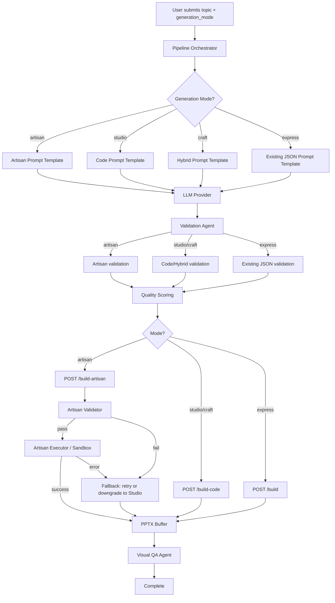
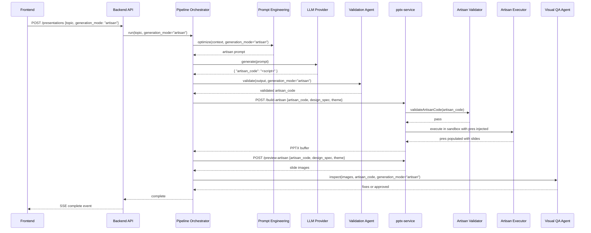

# Design Document: Full Code Generation (Artisan Mode) & Mode Rename

## Overview

This feature adds a fourth generation mode — **Artisan** — and renames all four modes to user-friendly names throughout the platform. The existing three modes are renamed: `json` → `express`, `hybrid` → `craft`, `code` → `studio`. In Artisan mode, the LLM generates a single, complete, self-contained pptxgenjs JavaScript script that creates the entire presentation from scratch, unlike Studio mode where the system creates the presentation object and slides then hands each slide to the LLM's per-slide `render_code`.

The Artisan mode gives the LLM total control: creating slides via `pres.addSlide()`, choosing colors (theme is optional), setting presentation-level properties (masters, layouts, global defaults), and writing all rendering code as one unified script. This enables cross-slide awareness and maximum creative freedom.

The design follows the patterns established in the [LLM PptxGenJS Code Generation spec](../llm-pptxgenjs-codegen/design.md), extending the existing Code Validator / Code Executor / sandbox architecture with Artisan-specific variants that operate on full scripts rather than per-slide code.

### Key Differences: Artisan vs Studio

| Aspect | Studio (per-slide) | Artisan (full script) |
|---|---|---|
| Scope | One `render_code` per slide | One `artisan_code` for entire presentation |
| Presentation object | System creates `pres` + `pres.addSlide()` | LLM calls `pres.addSlide()` itself |
| Character limit | 50,000 per slide | 500,000 total |
| Execution timeout | 10s per slide | 60s total |
| pptx-service endpoint | `/build-code`, `/preview-code` | `/build-artisan`, `/preview-artisan` |
| Sandbox entry point | `(slide, pres, theme, fonts, themes, iconToBase64)` | `(pres, theme, fonts, themes, iconToBase64)` |
| Fallback | Per-slide JSON fallback | Entire presentation falls back to Studio mode |
| Cross-slide awareness | None (each slide isolated) | Full (script sees all slides) |

## Architecture

### High-Level Flow



### Component Interaction (Artisan Path)



### Key Design Decisions

1. **Separate Artisan Validator and Executor modules** — Rather than extending the existing `code-validator.js` and `code-executor.js`, we create `artisan-validator.js` and `artisan-executor.js`. The existing modules validate per-slide code with `slide.*` API calls; Artisan validates full scripts with `pres.addSlide()`. Mixing both concerns in one module would add complexity and risk regressions. The blocked-pattern lists and AST-walking logic are similar but the entry-point semantics differ enough to warrant separation.

2. **Reuse Node.js `vm` module for Artisan sandbox** — Same rationale as the Studio mode design: `vm.createContext()` with a minimal context provides sufficient isolation. The Artisan sandbox injects `pres` (the presentation object) instead of `slide`, plus the same `theme`, `fonts`, `themes`, `iconToBase64`, and safe `console`. The 60-second timeout (vs 10s per slide) accounts for the script creating all slides in one execution.

3. **Artisan fallback to Studio, not Express** — When Artisan fails, the system falls back to Studio mode (per-slide code generation) rather than Express (JSON). Studio is the closest in capability and visual quality. The fallback re-runs the content generation pipeline with the Studio prompt template.

4. **Mode rename is a codebase-wide string replacement** — The rename from `code`→`studio`, `hybrid`→`craft`, `json`→`express` touches the `GenerationMode` enum, provider-to-mode mapping, API validators, frontend types, SSE events, and progress indicator. The old names are rejected at the API boundary with a helpful error message pointing to the new names.

5. **Async IIFE wrapper for Artisan execution** — Same pattern as Studio mode. The LLM code is wrapped in `(async function(pres, theme, fonts, themes, iconToBase64) { ... })()` and executed in the VM context. This allows `await iconToBase64(...)` calls within the script.

## Components and Interfaces

### 1. GenerationMode Enum (`backend/app/core/generation_mode.py`)

Updated enum with four values and new provider-to-mode mapping.

```python
class GenerationMode(str, enum.Enum):
    ARTISAN = "artisan"
    STUDIO = "studio"
    CRAFT = "craft"
    EXPRESS = "express"

PROVIDER_DEFAULT_MODES: dict[ProviderType, GenerationMode] = {
    ProviderType.claude: GenerationMode.ARTISAN,
    ProviderType.openai: GenerationMode.STUDIO,
    ProviderType.groq: GenerationMode.CRAFT,
    ProviderType.local: GenerationMode.EXPRESS,
}
```

### 2. Artisan Validator (`pptx-service/artisan-validator.js`)

AST-based static analysis for full Artisan scripts. Follows the same pattern as `code-validator.js` but checks for `pres.addSlide()` instead of `slide.*` API calls.

```typescript
interface ArtisanValidationResult {
  valid: boolean;
  errors: ArtisanValidationError[];
}

interface ArtisanValidationError {
  type: 'blocked_api' | 'size_limit' | 'no_add_slide' | 'syntax_error';
  message: string;
  line?: number;
  column?: number;
}

// Public API
function validateArtisanCode(code: string): ArtisanValidationResult;

// Constants
const MAX_ARTISAN_CODE_LENGTH = 500_000;
```

**Implementation approach:**
- Parse code with `acorn` into an AST (same as `code-validator.js`)
- Walk the AST using `acorn-walk` to detect the same blocked patterns: `require()`, `import`, `process`, `child_process`, `fs`, `net`, `http`, `https`, `eval`, `Function()`, `setTimeout`, `setInterval`, `setImmediate`, `global`, `globalThis`, `__dirname`, `__filename`
- Verify code length ≤ 500,000 characters
- Verify at least one `pres.addSlide()` call exists in the AST (MemberExpression where object is `pres` and property is `addSlide`)

### 3. Artisan Executor (`pptx-service/artisan-executor.js`)

Sandbox execution engine for full Artisan scripts. Creates a fresh `pptxgenjs` presentation, injects it into the sandbox, executes the script, and returns the populated presentation.

```typescript
interface ArtisanExecutionResult {
  success: boolean;
  error?: string;
  slideCount?: number;
}

// Public API
async function executeArtisanCode(
  code: string,
  designSpec: object,
  theme: string
): Promise<{ result: ArtisanExecutionResult; pres?: PptxGenJS }>;

// Constants
const ARTISAN_EXECUTION_TIMEOUT_MS = 60_000;
```

**Implementation approach:**
- Create a fresh `pptxgenjs` presentation instance: `const pres = new pptxgen()`
- Build theme palette and fonts using existing `buildThemePalette()` and `getAllThemePalettes()`
- Create `vm.createContext()` with: `pres`, `theme` (ThemePalette), `fonts`, `themes`, `iconToBase64`, safe `console`, `Promise`
- Wrap code in async IIFE: `(async function(pres, theme, fonts, themes, iconToBase64) { ${code} })(pres, theme, fonts, themes, iconToBase64);`
- Compile with `vm.Script` and run in context with 60-second timeout
- Return the populated `pres` object for PPTX buffer generation

### 4. Artisan pptx-service Endpoints (`pptx-service/server.js`)

Two new Express routes following the pattern of `/build-code` and `/preview-code`:

**POST `/build-artisan`**
- Request body: `{ artisan_code: string, design_spec: object, theme: string }`
- Validates with `artisan-validator.js`, executes with `artisan-executor.js`
- Response: PPTX buffer with Content-Type and Content-Disposition headers
- Error: 422 with `{ error, retry_with_studio: true }` on validation/execution failure

**POST `/preview-artisan`**
- Same request body as `/build-artisan`
- Internally builds PPTX via Artisan executor, then converts to JPEG images via the existing `pptxToImages()` helper (LibreOffice + pdftoppm)
- Response: `{ images: string[], count: number }`

### 5. Artisan Prompt Template (`backend/app/agents/prompt_engineering.py`)

New `ARTISAN_TEMPLATE` alongside existing templates. Instructs the LLM to generate a single JavaScript function body that receives `pres` and creates the entire presentation.

```python
ARTISAN_TEMPLATE = PromptTemplate(
    provider_type=ProviderType.claude,
    system_prompt="""...""",  # Full pptxgenjs API reference + artisan-specific instructions
    user_prompt_template="""...""",
    few_shot_examples=[],
    json_schema_instructions="""
Return JSON with this exact structure:
{
  "artisan_code": "<complete JavaScript function body>"
}
The artisan_code must:
- Call pres.addSlide() to create each slide
- Use pptxgenjs API calls for all content
- Optionally use theme.* for colors (or choose own hex values)
- Include slide.addNotes() for speaker notes on each slide
""",
    optimization_notes="Artisan mode: full-script generation for maximum creative control."
)
```

Key differences from `CODE_TEMPLATE`:
- Instructs LLM to call `pres.addSlide()` (not receive a pre-created `slide`)
- Output is `{ "artisan_code": "<script>" }` (not a slides array)
- Theme colors are optional, not mandatory
- Includes instructions for presentation-level properties (masters, layouts)
- Includes `slide.addNotes()` instruction for speaker notes

### 6. Validation Agent Extension (`backend/app/agents/validation.py`)

New `validate_artisan_mode()` method added to `ValidationAgent`:

```python
def validate_artisan_mode(
    self,
    data: Dict[str, Any],
    execution_id: str,
) -> ValidationResult:
    """
    Artisan-mode validation pipeline.
    
    Steps:
    1. Strip markdown code fences
    2. Handle unwrapped script (no JSON wrapper)
    3. JSON repair (trailing commas, missing brackets) with 2 retries
    4. Verify artisan_code field is a non-empty string
    5. Verify artisan_code contains pres.addSlide()
    6. Enforce 500,000 character limit
    7. Round-trip validation
    """
```

New constants:
```python
ARTISAN_API_PATTERN = re.compile(r'pres\.addSlide\(\)')
MAX_ARTISAN_CODE_LENGTH = 500_000
```

The main `validate()` method gains a new routing branch:
```python
if generation_mode == GenerationMode.ARTISAN:
    return self.validate_artisan_mode(data, execution_id)
```

### 7. Pipeline Orchestrator Extensions (`backend/app/agents/pipeline_orchestrator.py`)

- **Mode resolution**: User override → checkpoint → provider default (unchanged logic, new enum values)
- **Endpoint routing**: Artisan mode routes to `/build-artisan` and `/preview-artisan`
- **Fallback**: Artisan failures retry once, then fall back to Studio mode by re-running content generation
- **CodeFailureTracker**: Extended with `artisan → studio` downgrade path (existing `code → hybrid → json` becomes `artisan → studio → craft → express`)
- **Provider failover**: When provider changes, generation mode remaps to new provider's default

### 8. Visual QA Agent Extension (`backend/app/agents/visual_qa.py`)

- Routes to `/preview-artisan` when `generation_mode == ARTISAN`
- For Artisan issues: sends the full `artisan_code` + issue descriptions to the LLM, asks for a corrected full script
- New `ARTISAN_FIX_PROMPT` template for full-script fixes (similar to `CODE_FIX_PROMPT` but operates on the entire script)

### 9. Frontend Components

**GenerationModeSelector** — Updated to four options with new names and hover tooltips:
```typescript
export type GenerationMode = 'artisan' | 'studio' | 'craft' | 'express'

const MODE_OPTIONS: ModeOption[] = [
  {
    key: 'artisan', label: 'Artisan', description: 'Bespoke AI-designed presentation', icon: '🎨',
    hint: 'AI writes the entire presentation as one script with full creative freedom — custom colors, cross-slide consistency, and unique layouts. Best visual quality but slower.',
  },
  {
    key: 'studio', label: 'Studio', description: 'Professional-grade slides', icon: '✦',
    hint: 'AI writes code for each slide individually with theme colors applied. Great visual quality with per-slide error recovery.',
  },
  {
    key: 'craft', label: 'Craft', description: 'Balanced quality & speed', icon: '⚡',
    hint: 'Simple slides use fast templates, complex slides get AI-generated code. Good balance of speed and quality.',
  },
  {
    key: 'express', label: 'Express', description: 'Fastest generation', icon: '⏱',
    hint: 'Uses pre-built templates for all slides. Fastest and most reliable, but limited layout variety.',
  },
]
```

Each option renders a small info icon (ⓘ) next to the label. On hover (desktop) or tap (mobile), a tooltip displays the `hint` text explaining how the mode works and how it differs from the others. The tooltip uses a `title` attribute or a lightweight popover component depending on the existing UI patterns.

**ProgressIndicator** — Updated `MODE_DESCRIPTIONS` and `MODE_BADGE` with four modes:
```typescript
const MODE_DESCRIPTIONS: Record<GenerationMode, Record<string, string>> = {
  artisan: {
    llm_provider: 'Generating complete pptxgenjs presentation script',
    validation: 'Validating full presentation script',
  },
  studio: {
    llm_provider: 'Generating pptxgenjs slide code with AI',
    validation: 'Validating generated code structure',
  },
  craft: {
    llm_provider: 'Generating slide content and code snippets',
    validation: 'Validating JSON structure and code snippets',
  },
  express: {},
}
```

**GenerationStatus type** — Updated to accept new mode names:
```typescript
generation_mode?: 'artisan' | 'studio' | 'craft' | 'express'
```

### 10. Backend API Changes

**`CreatePresentationRequest`** — Updated validator:
```python
@field_validator("generation_mode")
@classmethod
def generation_mode_must_be_valid(cls, v: Optional[str]) -> Optional[str]:
    if v is None:
        return None
    new_modes = {"artisan", "studio", "craft", "express"}
    old_modes = {"full_code", "code", "hybrid", "json"}
    cleaned = v.strip().lower()
    if cleaned in old_modes:
        raise ValueError(
            f"Mode '{cleaned}' has been renamed. Use: artisan, studio, craft, or express"
        )
    if cleaned not in new_modes:
        raise ValueError("generation_mode must be one of: artisan, studio, craft, express")
    return cleaned
```

## Data Models

### Artisan LLM Output

```json
{
  "artisan_code": "// Complete pptxgenjs script\nconst titleSlide = pres.addSlide();\ntitleSlide.background = { color: '0D1520' };\ntitleSlide.addText('Market Analysis Q4 2024', {\n  x: 0.5, y: 1.5, w: 9, h: 1.5,\n  fontSize: 40, bold: true, color: 'F1FAEE',\n  fontFace: fonts.fontHeader\n});\ntitleSlide.addNotes('Opening slide with key metrics...');\n\nconst contentSlide = pres.addSlide();\ncontentSlide.background = { color: 'F1FAEE' };\n// ... more slides"
}
```

### Generation Mode Enum (Updated)

```python
class GenerationMode(str, enum.Enum):
    ARTISAN = "artisan"
    STUDIO = "studio"
    CRAFT = "craft"
    EXPRESS = "express"
```

### Provider-to-Mode Mapping (Updated)

```python
PROVIDER_DEFAULT_MODES = {
    ProviderType.claude: GenerationMode.ARTISAN,
    ProviderType.openai: GenerationMode.STUDIO,
    ProviderType.groq: GenerationMode.CRAFT,
    ProviderType.local: GenerationMode.EXPRESS,
}
```

### CodeFailureTracker Downgrade Path (Updated)

```python
def downgraded_mode(self, current_mode: GenerationMode) -> GenerationMode:
    """Return the next lower mode: artisan → studio → craft → express."""
    if current_mode == GenerationMode.ARTISAN:
        return GenerationMode.STUDIO
    if current_mode == GenerationMode.STUDIO:
        return GenerationMode.CRAFT
    return GenerationMode.EXPRESS
```

### ThemePalette (Sandbox Context — unchanged)

```json
{
  "primary": "1A2332",
  "secondary": "2D8B8B",
  "accent": "A8DADC",
  "bg": "F1FAEE",
  "bgDark": "0D1520",
  "surface": "0D1520",
  "text": "1A2332",
  "muted": "94A3B8",
  "border": "6B7280",
  "highlight": "A8DADC",
  "chartColors": ["1A2332", "2D8B8B", "A8DADC", "5BA3A3", "3D6B6B", "82C0C0", "6B7280"]
}
```


## Correctness Properties

*A property is a characteristic or behavior that should hold true across all valid executions of a system — essentially, a formal statement about what the system should do. Properties serve as the bridge between human-readable specifications and machine-verifiable correctness guarantees.*

### Property 1: Artisan validator rejects unsafe code

*For any* JavaScript string that contains at least one blocked pattern (require, import, process, child_process, fs, net, http, https, eval, Function constructor, setTimeout, setInterval, setImmediate, global, globalThis, __dirname, __filename) OR exceeds 500,000 characters OR lacks a `pres.addSlide()` call, the Artisan Validator SHALL return `{ valid: false }` with at least one error in the errors array.

**Validates: Requirements 3.1, 3.2, 3.3**

### Property 2: Artisan validator result shape invariant

*For any* input string (valid or invalid, empty or non-empty), the Artisan Validator SHALL return an object with exactly two fields: `valid` (boolean) and `errors` (array). Each element in the errors array SHALL have a `type` (string) and `message` (string) field, and optionally `line` (number) and `column` (number) fields.

**Validates: Requirements 3.4**

### Property 3: Artisan executor error structure

*For any* syntactically valid JavaScript code that throws a runtime error during execution, the Artisan Executor SHALL return `{ success: false, error: <string> }` where the error string is non-empty.

**Validates: Requirements 4.4**

### Property 4: /build-artisan 422 on invalid scripts

*For any* request to `/build-artisan` where the `artisan_code` fails validation (blocked patterns, size limit, missing pres.addSlide()) or throws a runtime error, the endpoint SHALL return HTTP 422 with a JSON body containing `error` (string) and `retry_with_studio` (boolean, true).

**Validates: Requirements 5.5**

### Property 5: CodeFailureTracker downgrade threshold

*For any* sequence of boolean success/failure results recorded for a provider, `should_downgrade()` SHALL return true if and only if the failure rate over the last 10 results exceeds 30%.

**Validates: Requirements 6.4**

### Property 6: PipelineContext checkpoint round-trip

*For any* valid PipelineContext with a generation_mode set to any of the four modes (artisan, studio, craft, express), calling `to_checkpoint()` then `from_checkpoint()` SHALL produce a PipelineContext with the same `generation_mode` value.

**Validates: Requirements 7.5**

### Property 7: Python artisan validation correctness

*For any* dictionary input, the `validate_artisan_mode()` method SHALL return `is_valid=False` if the input lacks an `artisan_code` key, or the `artisan_code` value is not a non-empty string, or the `artisan_code` does not contain `pres.addSlide()`, or the `artisan_code` exceeds 500,000 characters.

**Validates: Requirements 8.1, 8.2, 8.3**

### Property 8: Code fence stripping preserves content

*For any* string `s`, wrapping `s` in markdown code fences (```json, ```javascript, or plain ```) and then calling `strip_code_fences()` SHALL produce a result equal to `s.strip()`.

**Validates: Requirements 8.4, 16.1**

### Property 9: API mode validation accepts exactly valid modes

*For any* string, the `generation_mode_must_be_valid` validator SHALL accept it if and only if it is one of "artisan", "studio", "craft", or "express" (case-insensitive, whitespace-trimmed). Old mode names ("full_code", "code", "hybrid", "json") SHALL be rejected with an error message containing the new mode names.

**Validates: Requirements 11.1, 11.2**

### Property 10: User mode override takes precedence

*For any* valid generation_mode value provided by the user and any LLM provider, the Pipeline Orchestrator SHALL use the user-specified mode, not the provider's default mode.

**Validates: Requirements 11.3**

### Property 11: Unwrapped script auto-wrapping

*For any* valid JavaScript string containing `pres.addSlide()` that is passed directly to the artisan validation (not wrapped in a JSON `{ "artisan_code": ... }` object), the Validation Agent SHALL wrap it into the expected `{ "artisan_code": "<script>" }` structure before validation proceeds.

**Validates: Requirements 16.2**

### Property 12: JSON repair recovers valid objects

*For any* valid JSON object, introducing a single trailing comma before `]` or `}` and then calling `_repair_json()` SHALL recover the original parsed object within 2 retry attempts.

**Validates: Requirements 16.3**

### Property 13: Artisan output JSON round-trip

*For any* valid artisan mode output object `{ "artisan_code": "<script>" }`, serializing to a JSON string and parsing back SHALL produce an equivalent object: `json.loads(json.dumps(x)) == x`.

**Validates: Requirements 16.4**

## Error Handling

### Artisan Validator Errors

| Error Type | Trigger | Response |
|---|---|---|
| `syntax_error` | Code cannot be parsed by acorn | `{ valid: false, errors: [{ type: "syntax_error", message, line, column }] }` |
| `blocked_api` | Code references blocked identifiers or calls | `{ valid: false, errors: [{ type: "blocked_api", message, line, column }] }` |
| `size_limit` | Code exceeds 500,000 characters | `{ valid: false, errors: [{ type: "size_limit", message }] }` |
| `no_add_slide` | Code lacks `pres.addSlide()` call | `{ valid: false, errors: [{ type: "no_add_slide", message }] }` |

### Artisan Executor Errors

| Error | Trigger | Response |
|---|---|---|
| Timeout | Script exceeds 60-second execution limit | `{ success: false, error: "Script execution timed out after 60000ms" }` |
| Runtime error | Any uncaught exception during execution | `{ success: false, error: "<error message>" }` |

### /build-artisan Endpoint Errors

| HTTP Status | Trigger | Response Body |
|---|---|---|
| 400 | Missing `artisan_code` field | `{ error: "artisan_code is required" }` |
| 422 | Validation failure or runtime error | `{ error: "<details>", retry_with_studio: true }` |
| 500 | Unexpected server error | `{ error: "<message>" }` |

### Pipeline Fallback Chain

```
Artisan attempt 1 (fails) → Artisan retry with same/error prompt → Studio fallback
```

When both Artisan attempts fail:
1. Pipeline logs the failure and records it in `CodeFailureTracker`
2. Pipeline switches `generation_mode` to `STUDIO`
3. Pipeline re-runs from `PROMPT_ENGINEERING` agent forward using Studio template
4. If Studio also fails, existing Studio→Craft→Express fallback chain applies

### Backend API Validation Errors

| Scenario | HTTP Status | Error Message |
|---|---|---|
| Old mode name used | 422 | `"Mode 'code' has been renamed. Use: artisan, studio, craft, or express"` |
| Invalid mode name | 422 | `"generation_mode must be one of: artisan, studio, craft, express"` |

## Testing Strategy

### Property-Based Tests (Hypothesis — Python)

Property-based tests validate universal correctness properties using the `hypothesis` library. Each test runs a minimum of 100 iterations with randomly generated inputs.

| Property | Test File | What Varies |
|---|---|---|
| P5: CodeFailureTracker threshold | `tests/test_code_failure_tracker_props.py` | Random sequences of success/failure booleans |
| P6: PipelineContext checkpoint round-trip | `tests/test_pipeline_context_props.py` | Random PipelineContext objects with all four modes |
| P7: Python artisan validation | `tests/test_artisan_validation_props.py` | Random dicts with/without artisan_code, varying lengths |
| P8: Code fence stripping | `tests/test_code_fence_strip_props.py` | Random strings wrapped in various fence formats |
| P9: API mode validation | `tests/test_mode_validation_props.py` | Random strings including valid modes, old modes, garbage |
| P10: User mode override | `tests/test_mode_override_props.py` | Random (provider, mode) pairs |
| P12: JSON repair | `tests/test_json_repair_props.py` | Random valid JSON with introduced trailing commas |
| P13: Artisan output round-trip | `tests/test_artisan_roundtrip_props.py` | Random artisan output objects |

Each property test is tagged with: `Feature: full-code-generation, Property {N}: {title}`

### Property-Based Tests (fast-check — JavaScript/Node.js)

For the pptx-service Node.js components, property tests use `fast-check`:

| Property | Test File | What Varies |
|---|---|---|
| P1: Artisan validator rejects unsafe code | `pptx-service/tests/artisan-validator.prop.test.js` | Random JS strings with injected blocked patterns |
| P2: Artisan validator result shape | `pptx-service/tests/artisan-validator.prop.test.js` | Random strings (valid and invalid) |
| P3: Artisan executor error structure | `pptx-service/tests/artisan-executor.prop.test.js` | Random code that throws various errors |
| P4: /build-artisan 422 response | `pptx-service/tests/artisan-endpoint.prop.test.js` | Random invalid artisan_code payloads |

### Unit Tests (Example-Based)

| Area | Test File | Coverage |
|---|---|---|
| GenerationMode enum values | `tests/test_generation_mode.py` | Req 1.1 |
| Provider-to-mode mapping | `tests/test_generation_mode.py` | Req 1.3–1.6 |
| ARTISAN_TEMPLATE content | `tests/test_prompt_engineering.py` | Req 2.1–2.7 |
| Artisan executor sandbox objects | `pptx-service/tests/artisan-executor.test.js` | Req 4.2, 4.3 |
| /build-artisan endpoint | `pptx-service/tests/artisan-endpoint.test.js` | Req 5.1, 5.3 |
| Artisan retry and fallback | `tests/test_pipeline_orchestrator.py` | Req 6.1–6.3 |
| Old mode name rejection | `tests/test_presentations_api.py` | Req 11.2 |
| Progress indicator descriptions | Frontend test | Req 12.1–12.5 |

### Integration Tests

| Area | Test File | Coverage |
|---|---|---|
| /build-artisan end-to-end | `pptx-service/tests/artisan-endpoint.integration.test.js` | Req 5.2, 5.4 |
| /preview-artisan end-to-end | `pptx-service/tests/artisan-endpoint.integration.test.js` | Req 5.4 |
| Existing endpoints unchanged | `pptx-service/tests/server.test.js` | Req 5.6, 14.1 |
| Existing validators unchanged | `pptx-service/tests/code-validator.test.js` | Req 3.5, 14.2 |
| Pipeline artisan→studio fallback | `tests/test_pipeline_orchestrator.py` | Req 6.3 |
| Performance benchmarks | `pptx-service/tests/artisan-perf.test.js` | Req 15.1–15.4 |

### Mode Rename Migration Testing

The mode rename requires updating string literals across the codebase. The testing strategy:
1. **Grep audit**: Search for all occurrences of old mode names ("code", "hybrid", "json" as generation mode values) and verify they are updated
2. **API rejection test**: Verify old names are rejected with helpful error messages
3. **Backward compatibility**: No backward compatibility needed — this is a breaking rename with clear error messages guiding users to new names
