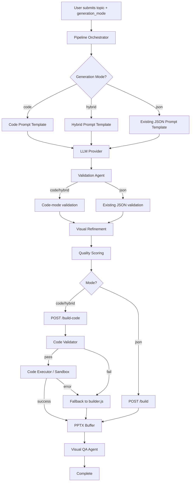
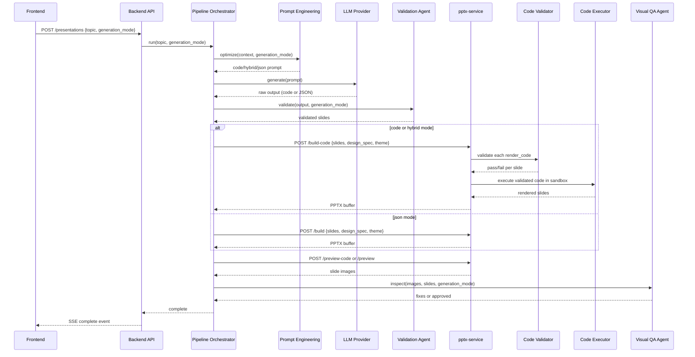

# Design Document: LLM PptxGenJS Code Generation

## Overview

This feature extends the AI Presentation Intelligence Platform to support a new generation mode where the LLM produces raw pptxgenjs JavaScript code instead of (or alongside) structured Slide_JSON. The current architecture routes all slide rendering through a ~2000-line `builder.js` with ~20 hardcoded layout renderers. The new approach gives the LLM pixel-level control over element positioning, styling, shapes, charts, tables, and visual effects.

Three generation modes are supported:
- **Code mode**: The LLM writes a complete JavaScript function body per slide using pptxgenjs API calls. The pptx-service validates and executes this code in a sandbox.
- **Hybrid mode**: The LLM produces standard Slide_JSON with an optional `render_code` field per slide. Slides with `render_code` are executed as code; slides without it fall through to the existing `builder.js` path.
- **JSON mode**: The existing Slide_JSON → builder.js pipeline, unchanged.

The system is designed for graceful degradation: if code generation fails for any slide, the system falls back to JSON-mode rendering. Provider capability mapping determines the default mode, and users can override it from the frontend.

## Architecture

### High-Level Flow



### Component Interaction



### Key Design Decisions

1. **Node.js `vm` module (built-in) for sandboxing** — `vm2` is deprecated and unmaintained (last release 2023, known escapes). `isolated-vm` adds a native dependency that complicates Docker builds. The built-in `vm` module with `vm.createContext()` provides sufficient isolation for our threat model: the code is LLM-generated (not user-supplied), we apply static analysis before execution, and we enforce timeouts. We harden it by creating a minimal context with no access to `require`, `process`, `global`, or any Node.js built-ins beyond what we explicitly inject.

2. **AST-based validation via `acorn`** — Regex-based blocklists are fragile (easily bypassed with string concatenation, template literals, or Unicode escapes). AST parsing with `acorn` lets us walk the syntax tree and reject any `CallExpression`, `MemberExpression`, or `Identifier` that references blocked APIs. This is more robust and maintainable. `acorn` is a zero-dependency, well-maintained parser already in the Node.js ecosystem.

3. **Inline pptxgenjs API reference in prompt** — Rather than a separate context document, the code prompt template embeds a condensed API reference and the common pitfalls section directly. This keeps the prompt self-contained and avoids context window fragmentation. The reference is derived from `skills/pptx/pptxgenjs.md`.

4. **Async sandbox via `vm.runInContext` with wrapper** — `iconToBase64` is async. We wrap the LLM-generated code in an async function, execute it in the VM context, and await the returned promise with a timeout. The sandbox context provides a pre-bound `iconToBase64` that delegates to the real implementation in `icons.js`.

## Components and Interfaces

### 1. Code Validator (`pptx-service/code-validator.js`)

Static analysis module that inspects LLM-generated JavaScript code before execution.

```typescript
interface ValidationResult {
  valid: boolean;
  errors: ValidationError[];
}

interface ValidationError {
  type: 'blocked_api' | 'size_limit' | 'no_pptx_call' | 'syntax_error';
  message: string;
  line?: number;
  column?: number;
}

// Public API
function validateSlideCode(code: string): ValidationResult;
```

**Implementation approach:**
- Parse code with `acorn` into an AST
- Walk the AST using `acorn-walk` to detect:
  - `require()` calls, `import` declarations
  - References to `process`, `child_process`, `fs`, `net`, `http`, `https`, `global`, `globalThis`
  - `eval()`, `Function()` constructor calls
  - `setTimeout`, `setInterval`, `setImmediate`
  - `__dirname`, `__filename`
- Verify code length ≤ 50,000 characters
- Verify at least one pptxgenjs API call pattern exists in the AST (`slide.addText`, `slide.addShape`, `slide.addChart`, `slide.addImage`, `slide.addTable`, or assignment to `slide.background`)

### 2. Code Executor (`pptx-service/code-executor.js`)

Sandbox execution engine that runs validated pptxgenjs code.

```typescript
interface ExecutionContext {
  slide: PptxGenJS.Slide;
  pres: PptxGenJS;
  theme: ThemePalette;
  fonts: { fontHeader: string; fontBody: string };
  themes: Record<string, ThemePalette>;
  iconToBase64: (iconName: string, color: string, size?: number) => Promise<string | null>;
}

interface ExecutionResult {
  success: boolean;
  error?: string;
  slideIndex: number;
}

// Public API
async function executeSlideCode(
  code: string,
  slide: PptxGenJS.Slide,
  pres: PptxGenJS,
  designSpec: object,
  theme: string
): Promise<ExecutionResult>;
```

**Implementation approach:**
- Create a `vm.createContext()` with only the allowed objects (slide, pres, theme, fonts, themes, iconToBase64)
- Wrap the LLM code in an async IIFE: `(async function(slide, pres, theme, fonts, themes, iconToBase64) { ${code} })`
- Compile with `vm.Script` and run in the sandboxed context
- Await the returned promise with a 10-second `AbortController` timeout
- Catch and report any runtime errors with slide index

### 3. Theme Palette Builder (`pptx-service/theme-palette.js`)

Extracts and formats theme palettes for injection into the sandbox context.

```typescript
interface ThemePalette {
  primary: string;    // 6-char hex, no #
  secondary: string;
  accent: string;
  bg: string;
  bgDark: string;
  surface: string;
  text: string;
  muted: string;
  border: string;
  highlight: string;
  chartColors: string[];
}

// Public API
function buildThemePalette(designSpec: object, theme: string): ThemePalette;
function getAllThemePalettes(): Record<string, ThemePalette>;
```

**Implementation approach:**
- Reuse the existing `resolveDesign()` function from `builder.js` to resolve the active palette
- Map the resolved palette to the simplified `ThemePalette` interface (primary, secondary, accent, bg, bgDark, surface=cardBg, text, muted=slateL, border=slate, highlight=gold, chartColors)
- Export all 10 built-in themes as a lookup object

### 4. New pptx-service Endpoints (`pptx-service/server.js`)

Two new Express routes:

**POST `/build-code`**
- Request body: `{ slides: SlideObject[], design_spec: object, theme: string }`
- Each `SlideObject` may have `render_code` (code/hybrid) or standard JSON fields
- For each slide:
  1. If `render_code` present → validate → execute in sandbox
  2. If `render_code` absent → route to existing `builder.js` rendering
  3. If validation/execution fails and JSON fields present → fallback to `builder.js`
- Response: PPTX buffer with appropriate Content-Type and Content-Disposition headers
- Error: 422 with per-slide error details if all slides fail

**POST `/preview-code`**
- Same request body as `/build-code`
- Internally calls the same rendering pipeline, then converts PPTX → PDF → JPEG images via LibreOffice + pdftoppm (same as existing `/preview`)
- Response: `{ images: string[], count: number }`

### 5. Prompt Engineering Extensions (`backend/app/agents/prompt_engineering.py`)

New prompt templates added alongside existing `CLAUDE_TEMPLATE`, `OPENAI_TEMPLATE`, etc.:

- `CODE_TEMPLATE`: Instructs the LLM to produce a JSON array where each element has `slide_id`, `slide_number`, `type`, `title`, `speaker_notes`, and `render_code` (a JavaScript function body string). Includes:
  - Condensed pptxgenjs API reference (text, shapes, charts, tables, images, backgrounds)
  - Common pitfalls section (no `#` in hex, no reusing option objects, `charSpacing` not `letterSpacing`, `breakLine` between array items, `bullet:true` not unicode)
  - Theme object reference (`theme.primary`, `theme.secondary`, etc.)
  - `iconToBase64` helper signature and available icon libraries
  - Design rules (no accent lines, dominance over equality, dark/light sandwich, visual motif)

- `HYBRID_TEMPLATE`: Extends the existing JSON template with instructions to optionally include `render_code` on complex slides (comparisons, multi-chart, infographics) while using standard JSON for simple slides.

The `prompt_engineering_agent.optimize()` method gains a `generation_mode` parameter to select the appropriate template.

### 6. Validation Agent Extensions (`backend/app/agents/validation.py`)

New validation paths:

- **Code mode**: Verify each slide has `slide_id`, `slide_number`, `type`, `title`, `speaker_notes`, `render_code`. Verify `render_code` is non-empty and contains at least one pptxgenjs API call pattern. Enforce 50,000 char limit.
- **Hybrid mode**: Slides with `render_code` → code-mode rules. Slides without → existing Slide_JSON schema validation.
- **Auto-correction**: Strip markdown code fences (`\`\`\`json`, `\`\`\`javascript`, `\`\`\``), fix double-escaped newlines/quotes in `render_code`, attempt JSON repair (trailing commas, missing brackets) with up to 2 retries.

### 7. Pipeline Orchestrator Extensions (`backend/app/agents/pipeline_orchestrator.py`)

- Add `generation_mode` field to `PipelineContext` (persisted in checkpoints)
- Provider-to-mode mapping: Claude/OpenAI → "code", Groq → "hybrid", Local → "json"
- On provider failover, remap generation_mode to the new provider's default
- Route PPTX build/preview calls to `/build-code` or `/build` based on mode
- Track code generation failure rate per provider; downgrade mode if >30% failure over last 10 requests

### 8. Visual QA Agent Extensions (`backend/app/agents/visual_qa.py`)

- Use `/preview-code` endpoint when mode is "code" or "hybrid"
- For code-generated slides with issues: instruct LLM to produce corrected `render_code`, providing original code + issue description
- For JSON-rendered slides in hybrid mode: apply existing JSON-based fix logic
- Pass full slide array with `render_code` fields to preview endpoint for re-rendering

### 9. Frontend Changes

**PresentationGenerator component** — Add a `GenerationModeSelector` component below the theme selector:
- Three radio/toggle options: Code ("Highest Visual Quality"), Hybrid ("Balanced"), JSON ("Classic / Fastest")
- Default based on active provider (fetched from a new `/api/v1/settings/defaults` endpoint or hardcoded initially)
- Include `generation_mode` in the POST request body

**ProgressIndicator component** — Read `generation_mode` from SSE `agent_start` events:
- Code mode: "Generating pptxgenjs slide code with AI" / "Validating generated code structure"
- Hybrid mode: "Generating slide content and code snippets" / "Validating JSON structure and code snippets"
- JSON mode: existing descriptions unchanged
- Display mode badge next to "Generating Presentation" header

### 10. Backend API Changes

**`CreatePresentationRequest`** — Add optional `generation_mode: Optional[str]` field with validation against `{"code", "hybrid", "json"}`.

**`generate_presentation_task`** — Pass `generation_mode` to `pipeline_orchestrator.run()`.

**SSE events** — Include `generation_mode` field in `agent_start` event data.

## Data Models

### Slide Object (Code Mode)

```json
{
  "slide_id": "1",
  "slide_number": 1,
  "type": "title",
  "title": "Market Analysis Q4 2024",
  "speaker_notes": "Opening slide with key metrics...",
  "render_code": "slide.background = { color: theme.bgDark };\nslide.addText('Market Analysis Q4 2024', {\n  x: 0.5, y: 1.5, w: 9, h: 1.5,\n  fontSize: 40, bold: true, color: theme.text,\n  fontFace: fonts.fontHeader\n});\n// ... more pptxgenjs calls"
}
```

### Slide Object (Hybrid Mode — with code)

```json
{
  "slide_id": "5",
  "slide_number": 5,
  "type": "comparison",
  "title": "Build vs Buy Analysis",
  "speaker_notes": "Detailed comparison...",
  "content": {
    "comparison_data": {
      "left_column": { "heading": "Build", "bullets": ["..."] },
      "right_column": { "heading": "Buy", "bullets": ["..."] }
    }
  },
  "render_code": "// Custom comparison layout with icons and cards\nslide.background = { color: theme.bg };\n// ..."
}
```

### Slide Object (Hybrid Mode — without code, standard JSON)

```json
{
  "slide_id": "2",
  "slide_number": 2,
  "type": "content",
  "title": "Key Findings",
  "content": {
    "bullets": ["Finding 1...", "Finding 2..."],
    "icon_name": "Target",
    "highlight_text": "Revenue grew 34% YoY"
  },
  "visual_hint": "bullet-left",
  "speaker_notes": "Walk through each finding..."
}
```

### ThemePalette (Sandbox Context)

```json
{
  "primary": "1A2332",
  "secondary": "2D8B8B",
  "accent": "A8DADC",
  "bg": "F1FAEE",
  "bgDark": "0D1520",
  "surface": "0D1520",
  "text": "1A2332",
  "muted": "94A3B8",
  "border": "6B7280",
  "highlight": "A8DADC",
  "chartColors": ["1A2332", "2D8B8B", "A8DADC", "5BA3A3", "3D6B6B", "82C0C0", "6B7280"]
}
```

### Generation Mode Enum

```python
class GenerationMode(str, Enum):
    CODE = "code"
    HYBRID = "hybrid"
    JSON = "json"
```

### Provider-to-Mode Mapping

```python
PROVIDER_DEFAULT_MODES = {
    ProviderType.claude: GenerationMode.CODE,
    ProviderType.openai: GenerationMode.CODE,
    ProviderType.groq: GenerationMode.HYBRID,
    ProviderType.local: GenerationMode.JSON,
}
```

### Code Failure Tracking (Pipeline Context)

```python
@dataclass
class CodeFailureTracker:
    recent_results: deque  # maxlen=10, stores bool (True=success)
    
    @property
    def failure_rate(self) -> float:
        if not self.recent_results:
            return 0.0
        failures = sum(1 for ok in self.recent_results if not ok)
        return failures / len(self.recent_results)
    
    def should_downgrade(self) -> bool:
        return self.failure_rate > 0.30
```

