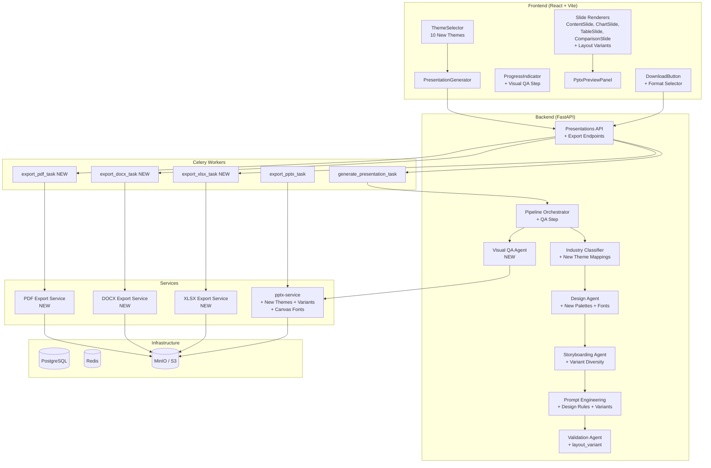
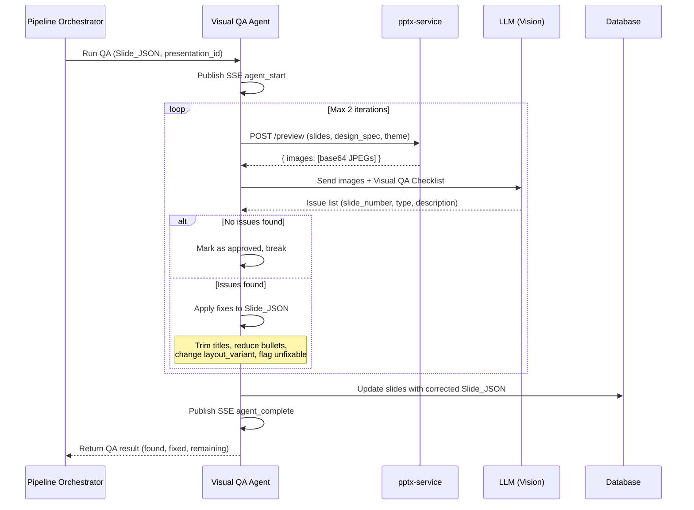
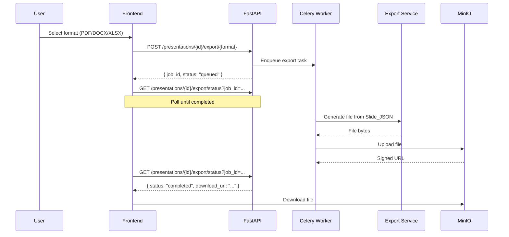

# Design Document: PPT Skills Integration

## Overview

This design integrates seven skill collections into the AI Presentation Intelligence Platform, touching every layer of the stack: frontend React components, backend FastAPI agents, the Node.js pptx-service, Celery workers, and Docker infrastructure.

The integrations are ordered by dependency:

1. **Theme Factory** (Req 1–16) — Foundation layer. Replaces 4 legacy themes with 10 new themes across all services. Every other integration depends on the theme system being correct.
2. **PPTX Design Rules** (Req 17–19) — Injects professional design principles into LLM prompts and the PPTX builder.
3. **Frontend Design Polish** (Req 20–23) — Improves UI aesthetics for 4 key components.
4. **Canvas-Design Fonts** (Req 24–25) — Adds 5 new font pairings and installs font files in Docker.
5. **Alternative Export Formats** (Req 26–31) — Adds PDF, DOCX, XLSX export alongside PPTX.
6. **LLM-Driven Layout Variants** (Req 32–36) — Enables per-slide layout variety via a new `layout_variant` field.
7. **Automated Visual QA Pipeline** (Req 37–38) — Post-generation visual inspection loop using LLM vision.

**Key design decisions:**
- Theme data is defined once per layer (tokens.ts, validation.py, design_agent.py, pptx_export.py, builder.js) rather than centralized, because each layer needs a different representation (CSS hex, RGBColor objects, JS objects).
- The Visual QA Agent runs as a post-pipeline step rather than inline, to avoid blocking the main generation flow and to operate on the final rendered output.
- Layout variants are optional and backward-compatible — slides without `layout_variant` render using existing default layouts.
- Export services are independent Celery tasks to avoid blocking the API and to support large presentations.

## Architecture

### High-Level System Diagram



### Visual QA Pipeline Sequence



### Export Flow Sequence



## Components and Interfaces

### 1. Theme Factory — Component Changes

**Frontend:**

| File | Change |
|------|--------|
| `frontend/src/styles/tokens.ts` | Replace 4 legacy theme palettes with 10 new theme palettes. Update `Theme` type. |
| `frontend/src/types/index.ts` | Update `Theme` type to union of 10 new theme identifiers. |
| `frontend/src/utils/themeUtils.ts` | Update `bgDarkMap` for 10 new themes. Update `getThemeColors`. |
| `frontend/src/components/ThemeSelector.tsx` | Replace `THEME_OPTIONS` array with 10 new entries. Update grid to `sm:grid-cols-5`. |
| `frontend/src/components/PresentationWorkflow.tsx` | Change default theme state from `'corporate'` to `'ocean-depths'`. |
| `frontend/src/components/SlideRenderer.tsx` | No structural change — consumes theme via `resolveColors`. |
| `frontend/src/utils/layoutEngine.ts` | Update default theme fallback to `'ocean-depths'`. |

**Backend:**

| File | Change |
|------|--------|
| `backend/app/agents/validation.py` | Replace `VALID_THEME_NAMES` frozenset with 10 new themes. Add underscore/hyphen normalization. |
| `backend/app/agents/design_agent.py` | Replace `FALLBACK_PALETTES` with 10 new DesignSpec entries. Add 5 new font pairs to `AVAILABLE_FONT_PAIRS`. |
| `backend/app/agents/industry_classifier.py` | Rewrite `_select_theme()` with new industry→theme mappings. |
| `backend/app/services/pptx_export.py` | Replace `ThemeColors` class with 10 new color dictionaries. Update `get_theme()` fallback to `ocean-depths`. |
| `backend/app/agents/pipeline_orchestrator.py` | Change default theme fallback to `'ocean-depths'`. |
| `backend/app/agents/layout_engine.py` | Change default theme fallback to `'ocean-depths'`. |
| `backend/app/services/cache_warming_task.py` | Change default theme to `'ocean-depths'`. |
| `backend/app/services/presentation_cache.py` | Change default theme to `'ocean-depths'`. |
| `backend/app/services/industry_classifier_service.py` | Change fallback theme to `'ocean-depths'`. |
| `backend/app/worker/tasks.py` | Update default theme reference to `'ocean-depths'`. |
| `backend/app/api/v1/presentations.py` | Update `theme_must_be_valid` validator with 10 new theme names. |
| `backend/app/api/v1/export_templates_admin.py` | Replace `theme_colors` dict with 10 new entries. Fallback to `ocean-depths`. |

**pptx-service:**

| File | Change |
|------|--------|
| `pptx-service/builder.js` | Replace `THEMES` object with 10 new palette entries. Update fallback to `ocean-depths`. |
| `pptx-service/server.js` | Update default theme parameter to `'ocean-depths'`. |

### 2. PPTX Design Rules — Component Changes

| File | Change |
|------|--------|
| `backend/app/agents/prompt_engineering.py` | Add 7 PPTX design rules to `CLAUDE_TEMPLATE.system_prompt`, `OPENAI_TEMPLATE.system_prompt`, and `GROQ_TEMPLATE.system_prompt`. |
| `backend/app/agents/design_agent.py` | Add 5 "Avoid" rules to the DesignSpec generation prompt in `DesignAgent._build_prompt()`. |
| `pptx-service/builder.js` | Ensure `margin: 0` on aligned text boxes, use `charSpacing` (not `letterSpacing`), use `mkShadow()` factory per element. |

### 3. Frontend Design Polish — Component Changes

| File | Change |
|------|--------|
| `frontend/src/components/ThemeSelector.tsx` | Add hover scale/elevation animations, theme-colored card borders, distinctive card styling. |
| `frontend/src/components/ProgressIndicator.tsx` | Add staggered step reveal animations, shimmer effect on progress bar, distinctive step styling. |
| `frontend/src/components/PresentationGenerator.tsx` | Add atmospheric gradient background, distinctive heading typography, gradient submit button. |
| `frontend/src/components/PptxPreviewPanel.tsx` | Add smooth slide transition animations (200-500ms), filmstrip hover effects, polished loading animation. |

### 4. Canvas-Design Fonts — Component Changes

| File | Change |
|------|--------|
| `backend/app/agents/design_agent.py` | Add 5 font pairs to `AVAILABLE_FONT_PAIRS`: Instrument Sans/Calibri, Work Sans/Calibri Light, Lora/Calibri, Outfit/Calibri, Crimson Pro/Calibri. |
| `pptx-service/fonts/` | Copy .ttf files from `skills/canvas-design/canvas-fonts/` for: InstrumentSans, WorkSans, Lora, Outfit, CrimsonPro (Regular, Bold, Italic variants). |
| `pptx-service/Dockerfile` | Add `COPY fonts/ /usr/share/fonts/custom/` and `RUN fc-cache -f -v`. |

### 5. Alternative Export Formats — New Components

| File | Status | Description |
|------|--------|-------------|
| `backend/app/services/pdf_export.py` | NEW | PDF generation from Slide_JSON using reportlab + matplotlib for charts. |
| `backend/app/services/docx_export.py` | NEW | DOCX generation from Slide_JSON using python-docx. |
| `backend/app/services/xlsx_export.py` | NEW | XLSX generation from Slide_JSON using openpyxl. |
| `backend/app/api/v1/presentations.py` | MODIFY | Add `POST /presentations/{id}/export/pdf`, `/docx`, `/xlsx` endpoints. |
| `backend/app/worker/tasks.py` | MODIFY | Add `export_pdf_task`, `export_docx_task`, `export_xlsx_task` Celery tasks. |
| `backend/pyproject.toml` | MODIFY | Add reportlab, python-docx, openpyxl, matplotlib dependencies. |
| `frontend/src/components/DownloadButton.tsx` | MODIFY | Add format selector dropdown (PPTX, PDF, DOCX, XLSX). |
| `frontend/src/services/api.ts` | MODIFY | Add `exportPdf()`, `exportDocx()`, `exportXlsx()` API functions. |

### 6. LLM-Driven Layout Variants — Component Changes

| File | Change |
|------|--------|
| `backend/app/agents/validation.py` | Add `layout_variant` field validation with per-type variant sets. Auto-correct invalid variants. |
| `backend/app/agents/prompt_engineering.py` | Add layout variant selection instructions to all 3 provider templates. |
| `backend/app/agents/storyboarding.py` | Add diversity constraint: no consecutive same-type slides share a layout_variant. |
| `pptx-service/builder.js` | Add rendering functions for all layout variants: `renderIconGrid`, `renderTwoColumnText`, `renderStatCallouts`, `renderTimeline`, `renderQuoteHighlight`, `renderChartFull`, `renderChartTop`, `renderChartWithKpi`, `renderTableWithInsights`, `renderTableHighlight`, `renderProsCons`, `renderBeforeAfter`. |
| `frontend/src/types/index.ts` | Add optional `layout_variant?: string` to `SlideData`. |
| `frontend/src/components/slides/ContentSlide.tsx` | Add variant rendering: icon-grid, two-column-text, stat-callouts, timeline, quote-highlight. |
| `frontend/src/components/slides/ChartSlide.tsx` | Add variant rendering: chart-full, chart-top, chart-with-kpi. |
| `frontend/src/components/slides/TableSlide.tsx` | Add variant rendering: table-with-insights, table-highlight. |
| `frontend/src/components/slides/ComparisonSlide.tsx` | Add variant rendering: pros-cons, before-after. |

### 7. Automated Visual QA Pipeline — New Components

| File | Status | Description |
|------|--------|-------------|
| `backend/app/agents/visual_qa.py` | NEW | Visual QA Agent — renders slides, sends to LLM vision, parses issues, applies fixes. |
| `backend/app/agents/pipeline_orchestrator.py` | MODIFY | Add `VISUAL_QA` to `AgentName` enum and `PIPELINE_SEQUENCE` (after `QUALITY_SCORING`). Add 60s latency budget. |
| `frontend/src/components/ProgressIndicator.tsx` | MODIFY | Add `visual_qa` step to `AGENT_PIPELINE` array. |


### Interface Contracts

**Visual QA Agent Interface:**

```python
@dataclass
class VisualQAIssue:
    slide_number: int
    issue_type: str  # "overlap", "text_overflow", "low_contrast", "misalignment", "spacing", "wrapping"
    description: str
    severity: str  # "critical", "warning", "info"
    fixable: bool
    suggested_fix: Optional[str] = None

@dataclass
class VisualQAResult:
    approved: bool
    iterations_run: int
    total_issues_found: int
    issues_fixed: int
    remaining_issues: int
    issues: List[VisualQAIssue]
    elapsed_ms: float
```

**Export Service Interface:**

```python
class ExportService(Protocol):
    def generate(self, slide_json: Dict[str, Any], theme: str, design_spec: Optional[Dict] = None) -> bytes:
        """Generate export file bytes from Slide_JSON."""
        ...
```

**Layout Variant Validation Maps:**

```python
CONTENT_LAYOUT_VARIANTS = frozenset({
    "numbered-cards", "icon-grid", "two-column-text",
    "stat-callouts", "timeline", "quote-highlight",
})
CHART_LAYOUT_VARIANTS = frozenset({
    "chart-right", "chart-full", "chart-top", "chart-with-kpi",
})
TABLE_LAYOUT_VARIANTS = frozenset({
    "table-full", "table-with-insights", "table-highlight",
})
COMPARISON_LAYOUT_VARIANTS = frozenset({
    "two-column", "pros-cons", "before-after",
})

DEFAULT_LAYOUT_VARIANTS = {
    "content": "numbered-cards",
    "chart": "chart-right",
    "table": "table-full",
    "comparison": "two-column",
}

LAYOUT_VARIANTS_BY_TYPE = {
    "content": CONTENT_LAYOUT_VARIANTS,
    "chart": CHART_LAYOUT_VARIANTS,
    "table": TABLE_LAYOUT_VARIANTS,
    "comparison": COMPARISON_LAYOUT_VARIANTS,
}
```

**New API Endpoints:**

| Method | Path | Request | Response |
|--------|------|---------|----------|
| POST | `/api/v1/presentations/{id}/export/pdf` | — | `{ job_id, status }` |
| POST | `/api/v1/presentations/{id}/export/docx` | — | `{ job_id, status }` |
| POST | `/api/v1/presentations/{id}/export/xlsx` | — | `{ job_id, status }` |
| GET | `/api/v1/presentations/{id}/export/status?job_id=...&format=...` | — | `{ job_id, status, download_url? }` |

## Data Models

### Theme Color Specifications

Each theme defines 9 frontend token keys and extended backend keys. Colors sourced from `skills/theme-factory/themes/*.md`.

#### Frontend Token Palettes (tokens.ts)

| Theme | primary | secondary | accent | bg | surface | text | muted | border | highlight |
|-------|---------|-----------|--------|----|---------|------|-------|--------|-----------|
| ocean-depths | #1a2332 | #2d8b8b | #a8dadc | #f1faee | #f5f8f6 | #1a2332 | #6b7280 | #d1d5db | #e8f4f4 |
| sunset-boulevard | #e76f51 | #f4a261 | #e9c46a | #ffffff | #fdf8f3 | #264653 | #6b7280 | #d1d5db | #fef3e2 |
| forest-canopy | #2d4a2b | #7d8471 | #a4ac86 | #faf9f6 | #f5f5f2 | #2d4a2b | #6b7280 | #d1d5db | #f0f2ec |
| modern-minimalist | #36454f | #708090 | #d3d3d3 | #ffffff | #f5f5f5 | #36454f | #708090 | #d3d3d3 | #f0f0f0 |
| golden-hour | #f4a900 | #c1666b | #d4b896 | #ffffff | #faf6f0 | #4a403a | #6b7280 | #d1d5db | #fdf4e0 |
| arctic-frost | #4a6fa5 | #c0c0c0 | #d4e4f7 | #fafafa | #f5f7fa | #2c3e50 | #6b7280 | #d1d5db | #edf3fc |
| desert-rose | #d4a5a5 | #b87d6d | #e8d5c4 | #ffffff | #faf5f0 | #5d2e46 | #6b7280 | #d1d5db | #f8ede4 |
| tech-innovation | #0066ff | #00ffff | #00cccc | #1e1e1e | #2a2a2a | #ffffff | #9ca3af | #374151 | #1a1a3e |
| botanical-garden | #4a7c59 | #f9a620 | #b7472a | #f5f3ed | #f0ede6 | #3a3a3a | #6b7280 | #d1d5db | #f0f5e8 |
| midnight-galaxy | #4a4e8f | #a490c2 | #e6e6fa | #2b1e3e | #362a4e | #e6e6fa | #9ca3af | #4a4060 | #3d2e5e |

**Dark themes** (bg is dark, text is light): `tech-innovation`, `midnight-galaxy`
**Light themes** (bg is light/white, text is dark): all others

#### bgDarkMap (themeUtils.ts)

| Theme | bgDark |
|-------|--------|
| ocean-depths | #0d1520 |
| sunset-boulevard | #1a2f3a |
| forest-canopy | #1a2d1a |
| modern-minimalist | #1a2028 |
| golden-hour | #2a2420 |
| arctic-frost | #2a3a50 |
| desert-rose | #3a1a2a |
| tech-innovation | #0a0a0a |
| botanical-garden | #2a3a2a |
| midnight-galaxy | #1a1028 |

#### Backend PPTX Export Colors (pptx_export.py)

Each theme maps to a dictionary with these keys: `primary`, `secondary`, `accent`, `accent2`, `text`, `text_light`, `background`, `surface`, `divider`, `kpi_bg`, `kpi_text`, `header_bar`, `chart_colors` (7 RGBColor values).

The `accent2` and extended keys (`kpi_bg`, `kpi_text`, `header_bar`, `divider`, `surface`) are derived from the theme-factory base colors:
- `kpi_bg` = primary color
- `kpi_text` = white (light themes) or accent (dark themes)
- `header_bar` = primary color
- `surface` = slightly tinted version of background
- `divider` = light gray tinted with primary

#### Backend Fallback Palettes (design_agent.py)

Each DesignSpec entry maps theme-factory colors to the DesignSpec fields:
- `primary_color` → theme's primary/darkest color
- `secondary_color` → theme's secondary color
- `accent_color` → theme's accent/highlight color
- `background_color` → theme's background color
- `background_dark_color` → bgDark value
- `text_color` → theme's text color
- `text_light_color` → theme's muted color
- `chart_colors` → 5-7 colors derived from the palette
- `font_header` / `font_body` → from theme-factory typography specs

#### PPTX Builder Palettes (builder.js)

Each palette entry in the `THEMES` object contains: `navy`, `teal`, `tealDk`, `blue`, `blueLt`, `white`, `offwhite`, `slate`, `slateL`, `dark`, `gold`, `green`, `red`, `cardBg`, `cardBg2`, `accent`, `primary`, `secondary`, `text`, `textLight`, `bg`, `bgDark`, `chartColors`, `fontHeader`, `fontBody`.

### Layout Variant Enum

```typescript
// Content slide variants
type ContentLayoutVariant =
  | 'numbered-cards'    // Default: numbered bullet cards (existing)
  | 'icon-grid'         // 2×2 or 2×3 grid with icon circles
  | 'two-column-text'   // Split bullets into two columns
  | 'stat-callouts'     // Large numbers (48-60pt) with labels
  | 'timeline'          // Numbered steps on horizontal line
  | 'quote-highlight'   // First bullet as large quote

// Chart slide variants
type ChartLayoutVariant =
  | 'chart-right'       // Default: insights left, chart right (existing)
  | 'chart-full'        // Full-width chart with overlaid title
  | 'chart-top'         // Chart top half, insights bottom
  | 'chart-with-kpi'    // Large KPI number left, chart right

// Table slide variants
type TableLayoutVariant =
  | 'table-full'        // Default: full-width table (existing)
  | 'table-with-insights' // Table left, insight bullets right
  | 'table-highlight'   // Table with highlighted row + callout

// Comparison slide variants
type ComparisonLayoutVariant =
  | 'two-column'        // Default: two equal columns (existing)
  | 'pros-cons'         // Green checkmarks vs red X icons
  | 'before-after'      // Muted left column, accent right column
```

### Visual QA Issue Structure

```python
@dataclass
class VisualQAIssue:
    slide_number: int
    issue_type: str
    # Valid issue_types:
    #   "overlap"       — elements overlapping
    #   "text_overflow"  — text cut off at boundaries
    #   "low_contrast"   — insufficient color contrast
    #   "misalignment"   — columns/elements not aligned
    #   "spacing"        — elements too close or uneven gaps
    #   "wrapping"       — text boxes too narrow
    #   "margin"         — insufficient edge margins
    description: str
    severity: str        # "critical" | "warning" | "info"
    fixable: bool
    suggested_fix: Optional[str] = None
```

### Visual QA Checklist Prompt

The checklist sent to the LLM with slide images:

```
Visually inspect these slides. Assume there are issues — find them.

Look for:
- Overlapping elements (text through shapes, lines through words, stacked elements)
- Text overflow or cut off at edges or box boundaries
- Elements too close together (less than 0.3 inch gaps)
- Uneven gaps (large empty area in one place, cramped in another)
- Insufficient margin from slide edges (less than 0.5 inch)
- Columns or similar elements not aligned consistently
- Low-contrast text (light text on light backgrounds or dark text on dark backgrounds)
- Low-contrast icons (dark icons on dark backgrounds without a contrasting circle)
- Text boxes too narrow causing excessive wrapping

For each issue found, respond in this JSON format:
{
  "issues": [
    {
      "slide_number": 1,
      "issue_type": "overlap|text_overflow|low_contrast|misalignment|spacing|wrapping|margin",
      "description": "Specific description of the issue",
      "severity": "critical|warning|info",
      "suggested_fix": "How to fix this issue"
    }
  ]
}

If no issues are found, respond with: { "issues": [] }
```

### Industry → Theme Mapping

| Industry | Theme |
|----------|-------|
| technology, fintech | tech-innovation |
| healthcare, pharmaceutical | arctic-frost |
| finance, insurance, consulting | ocean-depths |
| sustainability, wellness | forest-canopy |
| creative, marketing, advertising | sunset-boulevard |
| fashion, beauty | desert-rose |
| hospitality, artisan | golden-hour |
| food, agriculture | botanical-garden |
| entertainment, gaming | midnight-galaxy |
| executive audience + general business | modern-minimalist |
| default / unmatched | ocean-depths |

### Font Pairings (Expanded)

| Header Font | Body Font | Source |
|-------------|-----------|--------|
| Georgia | Calibri | Existing |
| Arial Black | Arial | Existing |
| Calibri | Calibri Light | Existing |
| Cambria | Calibri | Existing |
| Trebuchet MS | Calibri | Existing |
| Instrument Sans | Calibri | NEW — canvas-design |
| Work Sans | Calibri Light | NEW — canvas-design |
| Lora | Calibri | NEW — canvas-design |
| Outfit | Calibri | NEW — canvas-design |
| Crimson Pro | Calibri | NEW — canvas-design |

### Export Dependencies

| Library | Version | Purpose |
|---------|---------|---------|
| reportlab | ^4.0 | PDF generation |
| python-docx | ^1.1 | DOCX generation |
| openpyxl | ^3.1 | XLSX generation |
| matplotlib | ^3.8 | Chart rendering for PDF export |

## Correctness Properties

*A property is a characteristic or behavior that should hold true across all valid executions of a system — essentially, a formal statement about what the system should do. Properties serve as the bridge between human-readable specifications and machine-verifiable correctness guarantees.*

### Property 1: Theme palette structural completeness (frontend)

*For any* theme name in the Token_System registry, the palette object SHALL contain all 9 required keys (`primary`, `secondary`, `accent`, `bg`, `surface`, `text`, `muted`, `border`, `highlight`) and each value SHALL be a valid CSS hex color string matching the pattern `#[0-9a-fA-F]{6}`.

**Validates: Requirements 2.1**

### Property 2: Theme color dictionary structural completeness (backend export)

*For any* theme name in the PPTX_Export_Service's theme map, the color dictionary SHALL contain all 13 required keys (`primary`, `secondary`, `accent`, `accent2`, `text`, `text_light`, `background`, `surface`, `divider`, `kpi_bg`, `kpi_text`, `header_bar`, `chart_colors`) and `chart_colors` SHALL contain at least 4 RGBColor values.

**Validates: Requirements 5.1**

### Property 3: Invalid theme name rejection

*For any* string that is not one of the 10 valid theme names (in either hyphenated or underscored form), the Validation_Agent SHALL reject it as an invalid theme.

**Validates: Requirements 3.2**

### Property 4: Ocean-depths fallback (backend export)

*For any* string not recognized as a valid theme name, the PPTX_Export_Service SHALL return the `ocean-depths` color dictionary.

**Validates: Requirements 5.3**

### Property 5: Ocean-depths fallback (PPTX builder)

*For any* string not recognized as a valid theme name, the PPTX_Builder's `resolveDesign` function SHALL return the `ocean-depths` palette.

**Validates: Requirements 6.3, 8.6**

### Property 6: getThemeColors returns complete SlideColors

*For any* theme name in the Token_System registry, `getThemeColors` SHALL return a `SlideColors` object with all required fields populated (`primary`, `secondary`, `accent`, `bg`, `bgDark`, `surface`, `text`, `muted`, `border`, `highlight`, `chartColors`) and `chartColors` SHALL contain at least 4 entries.

**Validates: Requirements 11.2**

### Property 7: Design rules present in all provider prompts

*For any* LLM provider type (Claude, OpenAI, Groq), the system prompt template SHALL contain all 7 PPTX design rules: no accent lines under titles, one dominant color, dark backgrounds for title/conclusion, one visual motif, every slide needs a visual element, no centered body text, and varied layouts.

**Validates: Requirements 17.1–17.9**

### Property 8: PDF page count equals slide count

*For any* valid Slide_JSON containing N slides (where N ≥ 1), the PDF_Export_Service SHALL generate a PDF document with exactly N pages.

**Validates: Requirements 26.2**

### Property 9: DOCX slide separation

*For any* valid Slide_JSON containing N slides (where N ≥ 2), the DOCX_Export_Service SHALL insert exactly N−1 page breaks to maintain one-slide-per-page structure.

**Validates: Requirements 27.6**

### Property 10: XLSX worksheet per data slide

*For any* valid Slide_JSON, for every slide that contains chart data or table data, the XLSX_Export_Service SHALL create a worksheet named after that slide's title containing the corresponding data.

**Validates: Requirements 28.3, 28.4**

### Property 11: Layout variant validation and normalization

*For any* slide with a `layout_variant` field, if the variant is valid for that slide's type, the Validation_Agent SHALL accept it unchanged. If the variant is invalid for that slide's type or missing, the Validation_Agent SHALL accept the slide and normalize the variant to the default for that slide type.

**Validates: Requirements 32.2–32.7**

### Property 12: No consecutive duplicate layout variants

*For any* presentation plan produced by the Storyboarding_Agent, no two consecutive slides of the same type SHALL have the same `layout_variant`.

**Validates: Requirements 36.7**

### Property 13: Visual QA issue parser produces structured output

*For any* LLM response text that contains issue descriptions in the expected JSON format, the Visual_QA_Agent's parser SHALL produce a list of `VisualQAIssue` objects where each object has a valid `slide_number` (≥ 1), a valid `issue_type` from the defined set, and a non-empty `description`.

**Validates: Requirements 37.4**

## Error Handling

### Theme Resolution Errors

- **Unknown theme name at any layer**: Fall back to `ocean-depths`. Log a warning with the unrecognized theme name. Never raise an exception for an unknown theme — graceful degradation is preferred.
- **Missing palette key**: If a theme palette is missing a required key, use the `ocean-depths` value for that key. Log a warning.

### Export Service Errors

- **PDF generation failure** (reportlab error): Catch the exception, log the error with slide details, return a Celery task failure status. The user sees "Export failed" and can retry.
- **DOCX generation failure**: Same pattern as PDF.
- **XLSX generation failure**: Same pattern. If a slide title is too long for a worksheet name (>31 chars), truncate it.
- **Chart rendering failure in PDF**: If matplotlib fails to render a chart, skip the chart and render a placeholder text "Chart data available in PPTX format" on that page. Log the error.
- **MinIO upload failure**: Retry once with exponential backoff. If still failing, return task failure.

### Visual QA Pipeline Errors

- **pptx-service /preview timeout**: If the preview endpoint doesn't respond within 30 seconds, skip QA and proceed with the current Slide_JSON. Log the timeout.
- **LLM vision call failure**: If the LLM fails to analyze images, skip QA and proceed. Log the error.
- **LLM response parse failure**: If the LLM returns non-JSON or malformed JSON, treat it as "no issues found" and proceed. Log the raw response for debugging.
- **Fix application failure**: If applying a fix to Slide_JSON causes a validation error, revert to the pre-fix version and skip that fix. Log the failed fix.
- **60-second budget exceeded**: If the QA loop exceeds 60 seconds, stop immediately and proceed with the best available version. Log the timeout and remaining issues.
- **Max iterations reached with remaining issues**: Log the remaining issues at WARNING level, record them in the pipeline context, and proceed.

### Layout Variant Errors

- **Unrecognized layout_variant**: Auto-correct to the default variant for that slide type. Log a warning.
- **Layout variant for wrong slide type** (e.g., `chart-full` on a content slide): Auto-correct to the default variant for the actual slide type.
- **Missing layout_variant**: Use the default variant. No warning needed — this is expected for backward compatibility.

### Font Errors

- **Font not found in pptx-service**: pptxgenjs falls back to the system default font (typically Calibri). Log a warning with the missing font name.
- **Font file missing from Docker image**: The Dockerfile `fc-cache` step will report missing fonts at build time. At runtime, LibreOffice and pptxgenjs fall back gracefully.

## Testing Strategy

### Testing Approach

This feature uses a **dual testing approach**:
- **Property-based tests** (using Hypothesis for Python, fast-check for TypeScript): Verify universal properties across many generated inputs. Minimum 100 iterations per property test.
- **Unit tests**: Verify specific examples, edge cases, error conditions, and integration points.

Property-based testing is appropriate for this feature because:
- Theme validation involves input spaces (arbitrary strings) where PBT catches edge cases
- Export services transform structured data (Slide_JSON) where round-trip and structural properties hold
- Layout variant validation has a clear input→output mapping that should hold universally
- The Visual QA parser processes arbitrary LLM text where PBT tests robustness

### Property-Based Tests (Backend — Hypothesis)

Each property test references its design document property and runs minimum 100 iterations.

| Test | Property | Description |
|------|----------|-------------|
| `test_theme_palette_completeness` | Property 1 | Generate theme names from registry, verify all 9 keys present with valid hex values |
| `test_pptx_export_color_dict_completeness` | Property 2 | Generate theme names from registry, verify all 13 keys present |
| `test_invalid_theme_rejection` | Property 3 | Generate random strings (not in valid set), verify rejection |
| `test_ocean_depths_fallback_export` | Property 4 | Generate random invalid theme strings, verify ocean-depths returned |
| `test_ocean_depths_fallback_builder` | Property 5 | Generate random invalid theme strings, verify ocean-depths palette |
| `test_design_rules_in_all_providers` | Property 7 | Generate provider types, verify all 7 rules present in prompt |
| `test_pdf_page_count_equals_slides` | Property 8 | Generate random Slide_JSON with 1-25 slides, verify PDF page count |
| `test_docx_page_breaks` | Property 9 | Generate random Slide_JSON with 2-25 slides, verify N-1 page breaks |
| `test_xlsx_worksheet_per_data_slide` | Property 10 | Generate random Slide_JSON with mixed types, verify worksheets |
| `test_layout_variant_validation` | Property 11 | Generate slides with random layout_variant values, verify normalization |
| `test_no_consecutive_duplicate_variants` | Property 12 | Generate presentation plans, verify no consecutive duplicates |
| `test_qa_issue_parser` | Property 13 | Generate random issue JSON, verify structured output |

**Tag format:** `# Feature: ppt-skills-integration, Property {N}: {title}`

### Property-Based Tests (Frontend — fast-check)

| Test | Property | Description |
|------|----------|-------------|
| `test_getThemeColors_completeness` | Property 6 | Generate theme names from registry, verify all SlideColors fields |

### Unit Tests

| Test File | Coverage |
|-----------|----------|
| `test_theme_replacement.py` | Legacy theme removal (Req 1), new theme presence (Req 2-6), industry mappings (Req 7), defaults (Req 8) |
| `test_validation_themes.py` | Theme name validation, hyphen/underscore normalization (Req 3) |
| `test_design_rules.py` | Design rules in prompts (Req 17), avoid rules in design agent (Req 18) |
| `test_pdf_export.py` | PDF generation for each slide type (Req 26) |
| `test_docx_export.py` | DOCX generation for each slide type (Req 27) |
| `test_xlsx_export.py` | XLSX generation, worksheet naming, summary fallback (Req 28) |
| `test_export_api.py` | Export endpoints, Celery task enqueue, error handling (Req 29) |
| `test_layout_variants.py` | Variant validation, auto-correction, per-type variant sets (Req 32) |
| `test_visual_qa.py` | QA agent issue parsing, fix application, loop termination (Req 37-38) |
| `test_storyboarding_variants.py` | Layout variant diversity enforcement (Req 36.7) |
| `tokens.test.ts` | Frontend theme palette validation (Req 16) |
| `ThemeSelector.test.tsx` | 10 theme options rendered, selection callback (Req 9) |
| `DownloadButton.test.tsx` | Format selector with 4 options (Req 30) |
| `SlideVariants.test.tsx` | Layout variant rendering for each slide component (Req 36) |

### Integration Tests

| Test | Coverage |
|------|----------|
| `test_pipeline_with_qa.py` | Full pipeline including Visual QA step, SSE events |
| `test_export_e2e.py` | Export endpoint → Celery task → file generation → MinIO upload |
| `test_pptx_builder_variants.py` | PPTX builder renders each layout variant correctly |
